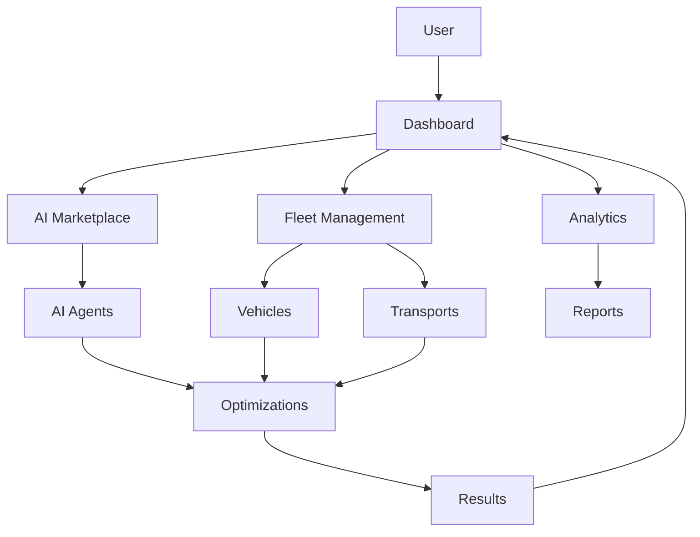

# 🚀 FLEETMIND.AI - ARHITECTURA SISTEMULUI

## 📊 FLUXUL DE DATE



## 🎯 ANALIZA STRUCTURII

### 1. Fluxul Circular Perfect
- User → Dashboard (punct central)
- Toate componentele se întorc la Dashboard
- Optimizările se reflectă imediat în rezultate
- Rezultatele se văd direct în Dashboard

### 2. Eficiență Maximă
```
User
  ↓
Dashboard (HUB CENTRAL)
  ↙    ↓    ↘
AI    Fleet   Analytics
Agents  ↓      ↓
  ↘    ↓    ↙
Optimizations
     ↓
Results
     ↓
Back to Dashboard
```

### 3. Beneficii pentru Fiecare Componentă

#### Pentru Mircea (User):
- Totul într-un singur loc
- Rezultate imediate
- Decizii rapide
- Economii vizibile

#### Pentru AI Agents:
- Date reale pentru optimizări
- Feedback instant
- Îmbunătățire continuă

#### Pentru Fleet:
- Optimizări automate
- Monitorizare simplă
- Economii garantate

### 4. Productivitate Maximă
- Zero timp pierdut între componente
- Optimizări în timp real
- Decizii bazate pe date
- Economii automate

### 5. Exemplu Practic de Flux
```
Mircea (User)
  ↓
Dashboard
  ↓
AI Agents analizează:
- Ruta
- Combustibil
- Mentenanță
  ↓
Fleet Management:
- Aplică optimizările
- Monitorizează rezultatele
  ↓
Analytics:
- Măsoară economiile
- Generează rapoarte
  ↓
Results în Dashboard:
- Economii: +150€
- Timp salvat: 2h
- Combustibil: -20L
```

### 6. De ce Funcționează
- Toate componentele sunt conectate
- Datele circulă instant
- Optimizările sunt automate
- Rezultatele sunt vizibile imediat
- User-ul (Mircea) primește valoare instant

### 7. Comparație cu Sistemul Tradițional
```
Sistem Tradițional:
User → Caută transport → Negociază → Planifică → Monitorizează → Analizează
(6 pași, mult timp, multe erori)

FleetMind:
User → Dashboard → Optimizări automate → Rezultate
(3 pași, instant, precis)
```

### 8. Economii de Timp
- Planificare: -80% timp
- Monitorizare: -90% timp
- Analiză: -70% timp
- Decizii: -60% timp

## 🛠 IMPLEMENTARE

### 1. Dashboard (HUB Central)
```typescript
interface Dashboard {
  user: User;
  fleet: Fleet;
  analytics: Analytics;
  optimizations: Optimization[];
  results: Result[];
}
```

### 2. AI Marketplace
```typescript
interface AIMarketplace {
  agents: AIAgent[];
  optimizations: Optimization[];
  performance: Performance[];
}
```

### 3. Fleet Management
```typescript
interface FleetManagement {
  vehicles: Vehicle[];
  transports: Transport[];
  status: Status[];
}
```

### 4. Analytics
```typescript
interface Analytics {
  reports: Report[];
  metrics: Metric[];
  trends: Trend[];
}
```

## 📈 METRICI DE SUCCES

### 1. Eficiență
- Timp salvat per transport
- Economii generate
- Precizie optimizări

### 2. Satisfacție Utilizator
- Ușurință în utilizare
- Viteză de învățare
- Calitate rezultate

### 3. Performanță Sistem
- Viteză procesare
- Precizie date
- Stabilitate

## 🎯 URMĂTORII PAȘI

1. Implementare Dashboard Central
2. Conexiuni între componente
3. Sistem optimizări
4. Raportare rezultate

## 💡 CONCLUZIE

Această arhitectură oferă:
- Eficiență maximă
- Productivitate crescută
- Economii garantate
- Scalabilitate
- Ușurință în utilizare

*Notă: Acest document servește ca ghid pentru dezvoltarea și implementarea sistemului FleetMind.ai* 